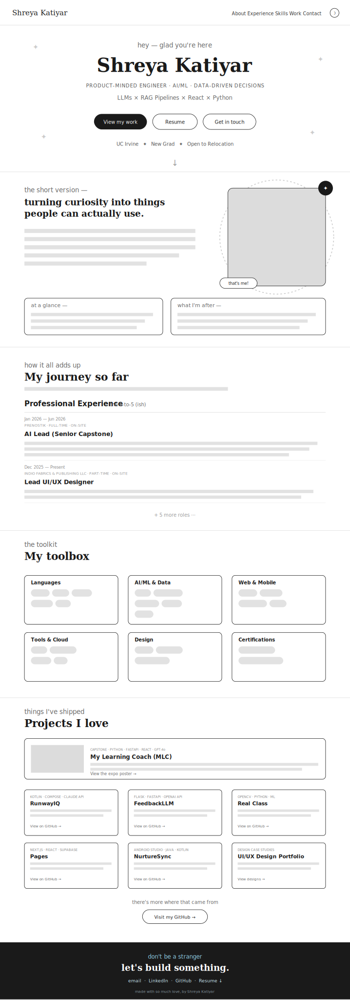
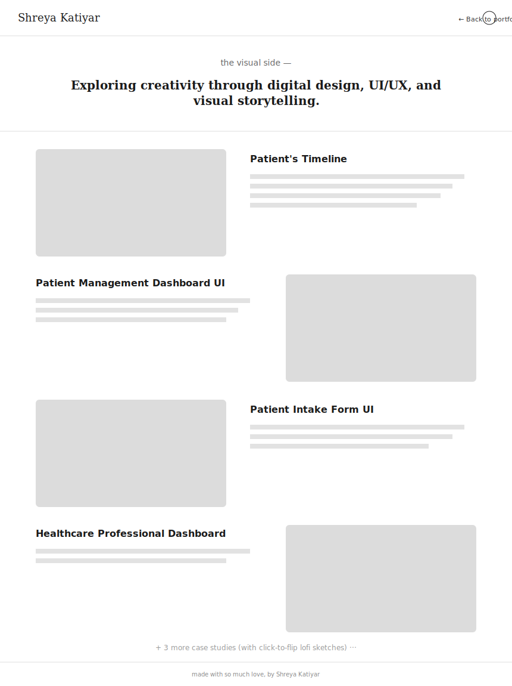

# Shreya Katiyar — Portfolio

My personal portfolio site, built with React + Vite. One main page (Home) plus a `/designs` page for UI/UX case studies.

## Stack

- **React 19 + Vite** — simple setup, fast dev server
- **React Router** — just two routes (`/` and `/designs`)
- **Plain CSS** — no Tailwind, no CSS-in-JS. All colors/fonts live as CSS variables in `src/index.css`, so theming is a one-file change
- **No animation library** — scroll reveals, cursor effects, etc. are hand-rolled with `IntersectionObserver` / `requestAnimationFrame`

## Structure

```
src/
  components/   UI pieces (Hero, About, Experience, Skills, Work, Contact, etc.)
  hooks/        useReveal, useTheme, useMagnetic
  pages/        Home.jsx, Designs.jsx
  index.css     colors, fonts, global styles
  App.css       everything else, organized by section
public/         images, resume, favicon
```

## Wireframes

Lofi sketches of the two pages, for reference:

**Home** (`/`)


**Designs** (`/designs`)


## Design notes

- Palette + fonts are all CSS variables — no hardcoded colors in components
- Dark/light mode is saved to `localStorage`, applied before React loads (no flash on refresh)
- Fonts: Lobster/Playfair for headings, Kalam (handwritten) for little accent lines, Quicksand for body text

## Known issue

GitHub Pages doesn't support client-side routing out of the box, so a direct link to `/designs` would 404 if deployed there as-is. Would need the `404.html` redirect trick or `HashRouter` to fix.

## Run it locally

```bash
npm install
npm run dev
```

Then open `http://localhost:5173`.
